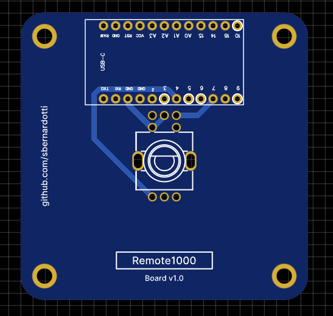

# Remote1000 Board v1.0

## Import project (EasyEDA)

At editor, open the document via: Top menu - File - Open - EasyEDA... , and select the json file, then open it at the editor, you can save it into a project.

## Components 

- Pro Micro ATmega32U4 5V/16MHz board
- EC11EBB24C03 (dual rotary encoder)
- Dual rotary encoder knobs from MobiFlight shop